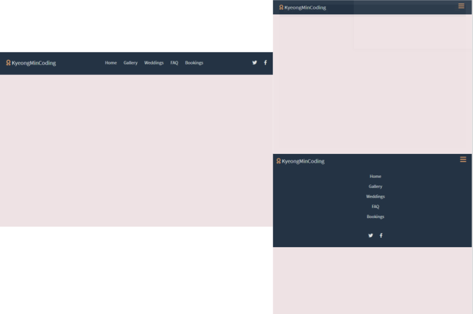

# 웹페이지 헤더 코딩(Create Navigation Bar)

## 강의 자료

[[드림코딩 엘리 - 웹사이트 따라만들기, 반응형 헤더편]](https://www.youtube.com/watch?v=X91jsJyZofw&list=PLv2d7VI9OotQ1F92Jp9Ce7ovHEsuRQB3Y&index=16)

## 강의를 볼 때 주의사항

강의를 보면서 따라만들면 내 것이 안된다.

강의를 보기 전에 화면만 보고 한번 만들어보고 잘 안되면 강의를 먼저 보고난 후에 강의를 생각하며 만든다.

부족한 부분 있다면 다시 강의를 보고난 후 생각하며 부족한 부분을 채워간다.

(강의를 많이 보는 것보다 중요한 것은 하나를 보더라도 내 것이 되는가이다.)

## 결과물



- 화면 크기에 따라 바뀌는 반응형 웹.
- 작은 화면에서 햄버거 바를 이용하여 메뉴 ON/OFF.
- CSS 변수를 사용 -> 여러 색이나 값을 동시에 변경 가능 -> 생산성 향상

## 코딩 순서 및 문제

### 1. 화면과 힌트만 보고 코딩

    [문제]
    - 아이콘 : 구글에서 검색 후 사용해서인지 이쁘지 않음.

    - 전체적으로 만들지 못함.

### 2. 강의 한번 끝까지 보고 코딩

    [해결]
    - 아이콘 : 구글에서 검색 후 사용해서인지 이쁘지 않음.
        >  https://fontawesome.com/kits/21dd925bf1/use?welcome=yes 사이트 이용.

    - 전체적으로 만들었으나 미흡한 부분이 많음.

    [문제]
    - font 적용 X
    - 아이콘 색 변경 X
    - 화면 작을 시, logo(KyeongminCoding) 위치 변경 X
    - 햄버거 바 사용 불가
    - CSS 변수 사용 불가
    - 배경화면 색 X

### 3. 부족한 부분이 있기에 강의를 한번 더 보고 수정

    [해결]
    - font 적용 X
        > https://fonts.google.com/ 사이트 이용.

    - 아이콘 색 변경 X
        > style.css에서 태그 i를 지정하여 컬러를 설정.

    - 화면 작을 시, logo(KyeongminCoding) 위치 변경 X
        > style.css에서 nav-bar에 aligm-items: flex-start; 적용한 후 다른 레이아웃 조정.

    - 햄버거 바 사용 불가
        > main.js 수정 및 index.html에서 태그 클래스 명 수정.

    - CSS 변수 사용 불가
        > var(변수명); 으로 사용.

    - 배경화면 색 X
        > style.css에서 body안에 background-color 지정.

## 필요한 내용 정리

- icon 사이트 : https://fontawesome.com/kits/21dd925bf1/use?welcome=yes

- font 사이트 : https://fonts.google.com/

- CSS 변수

```css
:root {
  --text-color: #dee0e0;
  --background-color: #243344;
  --accent-color: #c59567;
}
```

위와 같이 선언하여 **태그명, 클래스명, id명** 안에서 아래와 같이 사용이 가능하다.

```css
태그명,
클래스명,
id명 {
  color: var(--text-color);
  background-color: var(--background-color);
  color: var(--accent-color);
}
```

- script 태그 defer 속성 : script 태그의 defer 속성은 페이지가 모두 로드된 후에 해당 외부 스크립트가 실행됨을 명시합니다.
